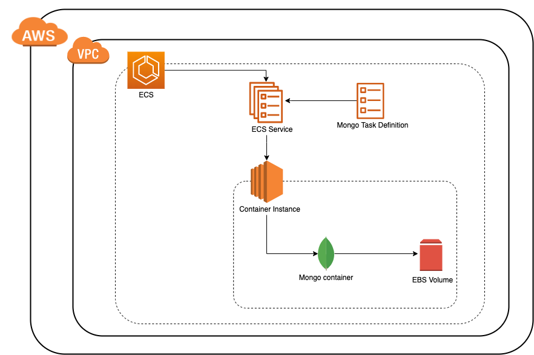

This module is part of a project to simplify the provisioning of MongoDB on AWS cloud using Terraform. You may also wish to consider [one of the other approaches](https://github.com/everest-engineering/terraform-aws-mongodb).

# Terraform module to provision MongoDB using AWS-ECS

Terraform module that provisions Mongo container in ECS-EC2 container instance.

This module creates the following resources required for mongo container to be up and running in ECS cluster. 

1. ECS cluster
2. ECS task definition and service for provided version of mongo
3. Roles required for EC2 to execute the task
4. EBS volume for persistent storage of mongo container

### Approach: 

This approach creates an ECS task for mongo and runs/manages that task on EC2 instance of provided instance type. This mongo task
uses a docker plugin called `rexray/ebs` to provision and use EBS volume for persistent storage of mongo container. 


#### Pros:
1. Simplified mongo infra management with just Terraform
2. Mongo task gets restarted automatically in case of failure
3. Easy version upgrades with minimal downtime
4. Auto provision of EBS volume
5. Built-in ECS monitoring provided in ECS dashboard
6. Data volume will not be lost unless deleted manually.

#### Cons: 
1. Rolling deployments are not supported yet due to mongo single instance limitation.
2. EBS volume size should be chosen carefully because it is not possible to expand it later as it is managed by docker plugin

## Terraform Versions

Terraform - [0.12.24](https://github.com/hashicorp/terraform/releases/tag/v0.12.24)

Terraform AWS provider version - [2.60](https://github.com/terraform-providers/terraform-provider-aws/releases/tag/v2.60.0)

## Prerequisites
1. Configure AWS credentials. Refer [this](https://docs.aws.amazon.com/amazonswf/latest/awsrbflowguide/set-up-creds.html) for help.
2. Make sure that your AWS user has permissions required to create all resources in the diagram
3. Install Terraform (version mentioned above) from [here](https://learn.hashicorp.com/terraform/getting-started/install.html)

## Usage
**Note:**  
Change the inputs to match your requirement
```hcl
module "mongo_ecs_ec2_cluster" {
    source = "path-to-the-module"

    security_group_id = "security-group-id"
    subnet_id = "subnet-id"
    ebs_volume_size = 5
    ebs_volume_type = "gp2"
    instance_type = "t3.medium"
    name = "mongo"
    region = "ap-southeast-1"
    stage = "Development"
    mongo_container_cpu = 512
    mongo_container_memory = 1024
    mongo_version = "4.0"
    
    tags = {
      Environment = "Development"
      TF-Managed = true
    }
}
```
## Examples
Try out the module functionality with an example defined [here](examples/mongo_cluster.tf). We are using [Terragrunt](https://github.com/gruntwork-io/terragrunt) for remote state management. 
Do [install](https://terragrunt.gruntwork.io/docs/getting-started/install/) it in case you want remote backend for state.

1. Switch to examples directory `cd examples`
2. Initialize Terraform to download required plugins `terraform init` | `terragrunt init`
3. Run `plan` to find out all resources that are going to be created `terraform plan` | `terragrunt plan`
4. Run `apply` to create those resources `terraform apply` | `terragrunt apply`
6. [Install](https://docs.mongodb.com/manual/mongo/) mongo shell and run `mongo <public_ip>:27017` to access mongodb
5. Make sure to destroy them once you are done exploring `terraform destroy` | `terragrunt destroy`

#### Note: 
1. Make sure to delete the EBS volume manually as `terraform destroy` won't delete it.
2. If remote state is used then delete the state management resources (S3 bucket and Dynamo table) created by Terragrunt manually.
## Inputs

| Name                      | Description                                                            | Type   | Default | Required |
|---------------------------|------------------------------------------------------------------------|:------:|:-------:|:--------:|
| name                      | Name to be used on all the resources as identifier                     | string | `n/a`   | yes      |
| security_group_id         | Id of the security group to attach to mongo instance                   | string | `n/a`   | yes      |
| subnet_id                 | Id of subnet to create mongo instance in (Private subnet recommended)  | string | `n/a`   | yes      |
| ebs_volume_size           | Size of EBS volume to be used by mongo container                       | number | `n/a`   | yes      |
| ebs_volume_type           | Type of EBS volume to be used by mongo container                       | string | `n/a`   | yes      |
| instance_type             | Type of EC2 instance to be used by ECS cluster for mongo task          | string | `n/a`   | yes      |
| region                    | Region to be used for creating all the above resources                 | string | `n/a`   | yes      |
| stage                     | Stage of the deployment                                                | string | `n/a`   | yes      |
| mongo_container_cpu       | CPU capacity to be allocated for mongo container                       | number | `n/a`   | yes      |
| mongo_container_memory    | Memory to be allocated for mongo container                             | number | `n/a`   | yes      |
| mongo_version             | Version tag of mongo docker image                                      | string | `n/a`   | yes      |
| tags                      | A map of default tags to add to all resources                          | map    | {}      | no       |

## Outputs

| Name                        | Description                                                                                    |
|-----------------------------|------------------------------------------------------------------------------------------------|
|ecs\_cluster\_arn            | The `arn` of mongo ECS cluster                                                                 |
|ecs\_cluster\_name           | The `name` of mongo ECS cluster                                                                |
|ecs\_cluster\_region         | The `region` where mongo ECS cluster is created                                                |
|mongo\_instance\_private\_ip | The private `IPV4` address of mongo instance to connect to mongodb                             |
|mongo\_instance\_public\_ip  | The public `IPV4` address of mongo instance to connect to mongodb (If created in public subnet)|

## Contributing
We appreciate your help!
 
[Open an issue](https://github.com/everest-engineering/terraform-aws-mongodb-ecs/issues/new/choose) or submit a pull request for an enhancement. 
Browse through the 
[current open issues](https://github.com/everest-engineering/terraform-aws-mongodb-ecs/issues).

## License
[](https://opensource.org/licenses/Apache-2.0)

## Authors
[](https://everest.engineering)

[](https://everest.engineering)
